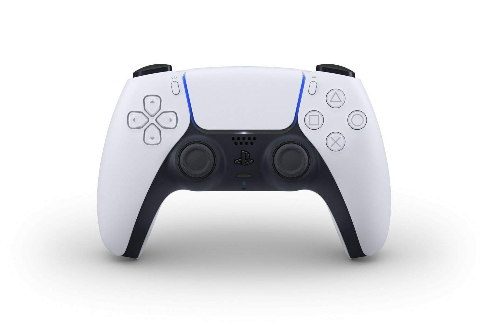
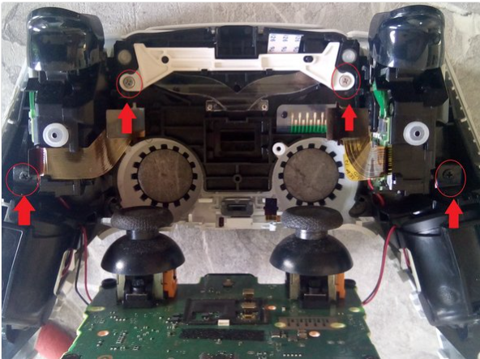
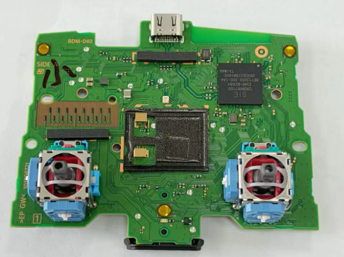
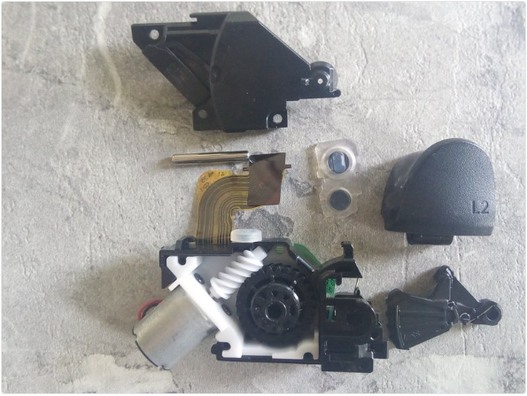
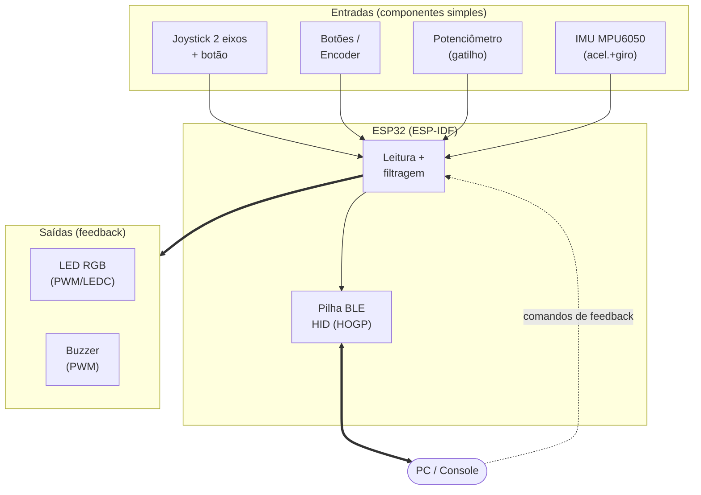

# Controle DualSense (PlayStation 5) — Gamepad Inteligente

**Trabalho 2 — Fundamentos de Sistemas Embarcados (FSE) — 2026/1**
**Produto de referência estudado:** Controle sem fio *Sony DualSense* (PlayStation 5)
**Categoria:** Entrada e Controle Manual — Gamepad / Joystick

## Integrantes do Grupo

| Nome Completo | Matrícula |
| ------------- | --------- |
| Kauã Vale Leão | 232014057 |
| Arthur Henrique Vieira | 231034064 |
| Davi Emanuel | 231026616 |

---

## Sumário

1. [Descrição do produto selecionado](#1-descrição-do-produto-selecionado)
2. [Análise técnica do funcionamento](#2-análise-técnica-do-funcionamento)
3. [Proposta de reprodução com ESP32](#3-proposta-de-reprodução-com-esp32)
4. [Pesquisa bibliográfica e tecnológica](#4-pesquisa-bibliográfica-e-tecnológica)
5. [Comparativo com produtos similares](#5-comparativo-com-produtos-similares)
6. [Referências](#6-referências)

---

## 1. Descrição do produto selecionado

### 1.1 Visão geral

O **DualSense** é o controle sem fio (gamepad) do **PlayStation 5**, lançado pela Sony em 2020. É um **dispositivo embarcado de interface humano-máquina (HID)** que captura os comandos do jogador (direção, botões, gatilhos e movimento) e, ao mesmo tempo, devolve **feedback tátil** (vibração háptica e resistência nos gatilhos).

Sucessor do **DualShock 4** (PS4), reúne em um único produto quase todas as classes de entrada manual — **joysticks de 2 eixos com botão**, botões digitais, **sensores inerciais (IMU)**, **touchpad capacitivo** e **atuadores hápticos**, com comunicação **Bluetooth** —, o que o torna um ótimo objeto de estudo para a categoria "Entrada e Controle Manual".

  
   
  <em>Figura 1 — Controle Sony DualSense (PlayStation 5).</em>

### 1.2 Funções principais

- **Captura de comandos direcionais** por meio de **dois joysticks analógicos de 2 eixos com clique (L3/R3)** e de um direcional digital (D-pad).
- **Entrada por botões** (4 botões de ação, 4 de ombro/gatilho, Options, Create, PS, mute).
- **Feedback háptico de alta definição:** dois atuadores de bobina de voz (*voice coil*) reproduzem sensações táteis ricas e localizadas.
- **Gatilhos adaptáveis (L2/R2):** oferecem **resistência variável** controlada por motor, simulando tensão (gatilho de arma, freio, tensão de um arco).
- **Detecção de movimento:** **IMU de 6 eixos** (acelerômetro + giroscópio) para controle por inclinação/gestos.
- **Touchpad** e **microfone/alto-falante** embutidos.
- **Comunicação sem fio** (Bluetooth) e por cabo (USB-C), com **bateria recarregável**.

### 1.3 Público-alvo e contexto de uso

- **Jogadores** de console (PlayStation 5) e de **PC** (o controle é compatível via USB/Bluetooth).
- **Desenvolvedores de jogos** que exploram a imersão tátil.
- **Aplicações fora do jogo:** o gamepad é amplamente reaproveitado para **teleoperação de robôs/drones**, **reabilitação motora** e **acessibilidade** (ver Seção 4).
- **Contexto de uso:** ambiente doméstico/portátil, segurado nas mãos, alimentado por bateria, comunicando-se sem fio em curta distância (poucos metros) com o console/PC.

### 1.4 Componentes e sensores utilizados (no produto real)

| Categoria | Componente | Detalhe técnico | Função |
| --------- | ---------- | --------------- | ------ |
| Entrada analógica | 2× joystick de 2 eixos com clique (L3/R3) | Cada eixo é lido por um potenciômetro; tecnologia sujeita a desgaste (*stick drift*) | Direção contínua + botão |
| Entrada digital | Botões de ação (Triângulo, Círculo, X, Quadrado), D-pad, L1/R1, Options, Create, PS, mute | Contatos com membrana condutiva | Comandos discretos |
| Entrada por força | 2× gatilho adaptável (L2/R2) | Potenciômetro de posição + **motor elétrico com engrenagem helicoidal (*worm gear*)** que aplica força contrária ao dedo | Eixo analógico + resistência variável (*force feedback*) |
| Atuadores hápticos | 2× atuador linear de bobina de voz (LRA) | Substituem os motores de massa rotativa (**ERM**) das gerações anteriores; geram vibração de banda larga acionada por sinal semelhante a áudio | Feedback tátil de alta fidelidade |
| Sensor inercial | IMU de 6 eixos | Acelerômetro de 3 eixos + giroscópio de 3 eixos (MEMS) | Detecção de movimento/inclinação |
| Sensor de toque | Touchpad capacitivo | 2 pontos de toque simultâneos, com clique | Entrada por gestos/toque |
| Áudio | Conjunto de microfones (com *mute*) + alto-falante mono | Captação de voz e efeitos sonoros | Comunicação e imersão |
| Sinalização | *Light bar* (LEDs RGB) + LEDs de jogador | Anel de luz ao redor do touchpad | Status e identificação do jogador |
| Conectividade | Bluetooth 5.1 + USB-C | Perfil HID (HOGP) sem fio; USB para fio e recarga | Comunicação com o host |
| Energia | Bateria Li-Ion recarregável (~1560 mAh) | Gestão de carga e modos de baixo consumo | Alimentação portátil |

### 1.5 Tecnologias de comunicação e controle embarcadas

- **Bluetooth (HID over GATT / HOGP):** transmite os relatórios de entrada (*HID reports*) com baixa latência ao console/PC.
- **USB-C:** modo com fio (menor latência) e recarga.
- **Microcontrolador interno dedicado:** lê todos os sensores, monta o pacote HID e gerencia os atuadores e a energia.
- **Protocolo HID:** padrão da indústria que descreve eixos e botões em um *report map*, permitindo reconhecimento automático pelo host.

---

## 2. Análise técnica do funcionamento

  
   
  <em>Figura 2 — Vista interna do DualSense (controle aberto), com os principais módulos descritos a seguir.</em>

### 2.1 Principais módulos do sistema

O DualSense pode ser dividido nos seguintes módulos funcionais:

- **Módulo de entrada (sensoriamento):** capta os comandos do usuário. Lê os eixos analógicos (joysticks e gatilhos) por **ADC**, os botões e o D-pad por **GPIO** e os sensores complexos (IMU e touchpad) por barramento serial (**I²C/SPI**).
- **Módulo de controle/decisão:** é o **microcontrolador interno**, que amostra periodicamente todas as entradas, organiza os valores e monta o **relatório HID** enviado ao host; também recebe e processa os comandos de retorno (háptica e gatilhos) vindos do console/PC.
- **Módulo de atuação (saída tátil):** devolve a resposta física ao usuário, acionando os **atuadores hápticos** (sinal semelhante a áudio), os **motores dos gatilhos adaptáveis** (resistência variável) e a *light bar*.
- **Módulo de interface com o usuário:** elementos de interação direta — *light bar* e LEDs de jogador (status), **alto-falante** e **microfone** (áudio).
- **Módulo de conectividade:** transmite os dados ao host por **Bluetooth** (sem fio) ou **USB-C** (com fio), usando o perfil **HID (HOGP)**.
- **Módulo de energia:** carrega e gerencia a **bateria Li-Ion**, aplicando técnicas de economia de energia (inatividade/*sleep*) para preservar a autonomia.

#### Componentes internos (vista de desmontagem)

As imagens abaixo, obtidas da desmontagem do controle, ilustram fisicamente os principais módulos descritos acima:

<table>
  <tr>
    <td align="center" width="50%">
       
      <em>Figura 3 — Placa principal (PCB): SoC de controle, USB-C e os dois joysticks analógicos (módulos de controle, conectividade e entrada).</em>
    </td>
    <td align="center" width="50%">
       
      <em>Figura 4 — Gatilho adaptável: motor + engrenagem helicoidal (atuação por força).</em>
    </td>
  </tr>
</table>

### 2.2 Tecnologias críticas

- **Protocolos sem fio de baixa latência:** o **Bluetooth/HID (HOGP)** precisa entregar comandos em poucos milissegundos para não prejudicar a jogabilidade; o compromisso entre latência e consumo do BLE é objeto de estudo (Artigo T1).
- **Atuação háptica:** os **atuadores de bobina de voz** reproduzem efeitos vibrotáteis de banda larga, exigindo geração de sinais próximos a áudio — tecnologia de ponta em interfaces táteis (Artigo T2).
- **Sensoriamento inercial (MEMS):** a **IMU** (acelerômetro + giroscópio MEMS) requer calibração e fusão de dados para um controle por movimento confiável (Artigo T3).
- **Sensoriamento capacitivo:** o **touchpad** depende de um sistema de toque capacitivo (sensor + front-end + microcontrolador) para detectar posição e gestos (Artigo T4).
- **Técnicas de economia de energia:** sendo a bateria curta, o firmware precisa de modos de baixo consumo, conciliados com a conexão BLE ativa (Artigo T1).
- **Sistemas embarcados em tempo real:** a amostragem das entradas e o envio dos relatórios HID precisam ocorrer em taxa alta e constante (tipicamente centenas de Hz).

---

## 3. Proposta de reprodução com ESP32

### 3.1 Ideia geral e escopo

Reproduzir o DualSense integralmente não é viável com componentes simples — recursos como a háptica de alta definição (bobina de voz), os gatilhos adaptáveis e o touchpad multitoque dependem de hardware proprietário e sofisticado. Por isso, **este trabalho propõe uma reprodução *parcial*, focada nas principais funcionalidades** do controle: a captura de comandos (direção, botões, gatilhos analógicos e movimento) e a comunicação sem fio, que constituem a essência de um gamepad. As funções não reproduzíveis são tratadas como limitações (Seção 3.5).

A base da proposta é a **ESP32**, que já integra **Bluetooth (BLE)** nativo e pode atuar como um **gamepad Bluetooth HID** real (perfil HID over GATT). Usando os componentes simples da lista da disciplina — joystick de 2 eixos, botões, potenciômetros, IMU, LED RGB e buzzer —, recriamos a captura de comandos e um feedback básico ao usuário, com o **ESP-IDF**.

> **Escopo mínimo (MVP):** o núcleo essencial e mais simples de montar é **joystick (2 eixos + botão) + alguns botões + BLE HID** — já um gamepad funcional reconhecido pelo host. A partir dele, o sistema cresce de forma incremental (LED/buzzer → IMU).

### 3.2 Mapeamento de funcionalidades → componentes (ecossistema ESP32)

| Funcionalidade do DualSense | Componente na reprodução (lista da disciplina) | Periférico/recurso da ESP32 |
| --------------------------- | ----------------------------------------------- | --------------------------- |
| Joysticks analógicos (direção) | **Joystick com 2 Eixos e 1 Botão** (potenciômetros) | ADC1 (`esp_adc`) + GPIO |
| Botões de ação / D-pad | **Botão**, **Encoder Rotativo + Botão** | GPIO |
| Gatilhos analógicos | **Potenciômetro (Analógico)** | ADC1 |
| Detecção de movimento | **Unidade de Medição Inercial (Acelerômetro e Giroscópio)** | I²C |
| Light bar / identificação | **Led RGB 5mm / SMD** | LEDC (PWM) |
| Feedback ao usuário | **Buzzer (Passivo)** — feedback sonoro | LEDC/PWM |
| Comunicação sem fio | ESP32 (rádio integrado) | **Bluetooth BLE HID** (`esp_hidd`) |
| Operação com fio / recarga | — | USB / bateria |
| Economia de energia | — | **Light/Deep sleep** |

> **Observações de viabilidade na ESP32:**
> - **ADC2 × BLE:** com o rádio BLE ativo, os pinos do **ADC2 ficam indisponíveis** — todas as entradas analógicas (joysticks + gatilhos, até ~6 canais) devem usar o **ADC1** (GPIO 32–39, 8 canais). Cabe, mas exige planejar os pinos.
> - **Feedback tátil:** não há motor de vibração na lista; o feedback ao usuário fica restrito ao **Buzzer** (sonoro) e ao **LED RGB** (visual).

### 3.3 Diagrama conceitual (blocos)

### 3.4 Lógica de funcionamento proposta

1. A ESP32 amostra, em alta frequência (ex.: 100–250 Hz), os **eixos analógicos** (ADC), os **botões** (GPIO) e a **IMU** (I²C).
2. Aplica **filtragem/zona morta** (*deadzone*) nos eixos e **debounce** nos botões.
3. Monta o **HID report** (eixos + estados de botão) e o envia ao host via **BLE HID**.
4. Recebe comandos de **feedback** do host e sinaliza com **LED RGB** e **buzzer**.
5. Entra em **modo de baixo consumo** após inatividade para preservar a bateria.

### 3.5 Limitações e desafios esperados

- **Háptica não é reproduzível com o kit:** os atuadores de bobina de voz do DualSense são muito sofisticados e não há motor de vibração na lista; o feedback fica restrito ao **buzzer (sonoro)** e ao **LED RGB (visual)**.
- **Gatilhos adaptáveis (resistência variável):** difíceis de reproduzir sem mecânica/motor dedicado — ficam fora do escopo; os gatilhos seriam apenas analógicos (potenciômetro).
- **Touchpad:** fica fora do escopo — a superfície multitoque do DualSense não é reproduzível com os componentes da lista.
- **Restrição ADC2 × BLE:** com o BLE ligado, as entradas analógicas precisam ficar todas no **ADC1** (GPIO 32–39); é necessário planejar o orçamento de pinos.
- **Calibração da IMU e dos joysticks:** necessário calibrar offset/zona morta para evitar *drift*.
- **Latência e taxa de atualização:** manter taxa de relatório alta e estável por BLE exige ajuste fino dos intervalos de conexão.
- **Ergonomia/montagem:** integrar tudo num formato segurável é um desafio mecânico (protótipo provavelmente em protoboard/case impresso).

---

## 4. Pesquisa bibliográfica e tecnológica

### 4.1 Artigos sobre as tecnologias que viabilizam o produto

1. *(a preencher)*
2. *(a preencher)*
3. *(a preencher)*
4. *(a preencher)*

### 4.2 Artigos sobre aplicação / uso do produto

1. *(a preencher)*
2. *(a preencher)*
3. *(a preencher)*
4. *(a preencher)*

---

## 5. Comparativo com produtos similares

Produtos da mesma categoria (gamepads), de diferentes fabricantes e gerações, comparados com o produto estudado (**Sony DualSense — PS5**):

| Produto | Feedback Tátil | Gatilhos | Sensor de Mov. | Touchpad | Microfone Embutido | Conectividade | Geração |
| ------- | -------------- | -------- | -------------- | -------- | ------------------ | ------------- | ------- |
| **Sony DualSense — PS5** *(estudado)* | **HD (bobina de voz)** | **Adaptáveis** | **Sim (6 eixos)** | **Sim** | **Sim** | Bluetooth 5.1 / USB-C | 2020 |
| Sony DualShock 4 — PS4 | Vibração (motores ERM) | Analógicos | Sim | Sim | Não | Bluetooth / USB | 2013 |
| Microsoft Xbox Wireless (Series X/S) | Vibração (rumble) | Analógicos | Não | Não | Não | Bluetooth / Xbox Wireless / USB-C | 2020 |
| Nintendo Switch Pro Controller | HD Rumble | Digitais | **Sim** | Não | Não | Bluetooth / USB-C | 2017 |
| 8BitDo Ultimate 2 (Bluetooth) | Vibração (rumble) | Analógicos (Hall) | Sim | Não | Não | Bluetooth / 2.4G / USB-C | 2024 |
| Logitech F310 (básico, com fio) | Não | Analógicos | Não | Não | Não | USB (com fio) | 2010 |

**Observações do comparativo:**
- O **DualSense** se destaca por concentrar as tecnologias mais avançadas de feedback tátil: **háptica de alta definição** + **gatilhos adaptáveis**, recursos ausentes na maioria dos concorrentes.
- A evolução geracional **DualShock 4 → DualSense** mostra o salto de vibração simples (motores ERM) para háptica de banda larga (bobina de voz).
- Em **durabilidade dos sticks**, soluções mais novas (8BitDo *Hall effect*) superam os potenciômetros tradicionais (que sofrem com *stick drift*).
- A reprodução com **ESP32 + joystick + IMU + sensor de toque + LED RGB + motor** cobre as funções essenciais (entrada e vibração simples) de todos esses gamepads, ficando aquém apenas na háptica HD e nos gatilhos adaptáveis.

*(Especificações coletadas de comparativos técnicos de mercado — ver Referências de produtos. Versões e recursos variam por modelo/região.)*

---

## 6. Referências

### 6.1 Artigos científicos (journals)

*(a preencher — ver Seção 4)*

### 6.2 Referências de produtos (comparativo)

- Comparing gamepads for Windows — Xbox Series vs. DualSense vs. 8BitDo Pro 2 (Level1Techs). https://forum.level1techs.com/t/comparing-gamepads-for-windows-microsoft-xbox-series-vs-sony-dualsense-vs-8bitdo-pro-2/178971
- DualSense: understanding haptic feedback and adaptive triggers (Son-Vidéo). https://blog.son-video.com/en/2024/05/dualsense-understanding-haptic-feedback-and-adaptive-triggers-on-the-ps5-controller/
- Best controllers for PC, PlayStation, Xbox and Switch (Galaxus). https://www.galaxus.at/en/page/best-controllers-for-the-pc-playstation-xbox-and-switch-38780

### 6.3 Documentação técnica dos componentes (produto real)

- [1] PS5 Controller Trigger Teardown — iFixit. https://www.ifixit.com/Teardown/PS5+Controller+Trigger+Teardown/158397
- [2] Teardown: PlayStation 5 DualSense controller — MicrocontrollerTips. https://www.microcontrollertips.com/tear-down-playstation-5-dualsense-controller-faq/
- [3] DualSense Wireless Controller (página oficial) — Sony/PlayStation. https://www.playstation.com/en-us/accessories/dualsense-wireless-controller/

### 6.4 Referências técnicas (ESP32 / BLE HID)

- Espressif — ESP-IDF Programming Guide. https://docs.espressif.com/projects/esp-idf/en/stable/
- ESP32-BLE-Gamepad (biblioteca de referência para HID over BLE). https://github.com/lemmingDev/ESP32-BLE-Gamepad
- HID over GATT Profile (HOGP) — Texas Instruments. https://www.ti.com/lit/pdf/swra715

---

> **Status do documento:** em desenvolvimento. Itens a finalizar antes da entrega: (1) preencher os 8 artigos científicos da Seção 4 (pesquisa nas bases acadêmicas: CAPES, Scopus, IEEE Xplore); (2) confirmar as imagens das Figuras 2 a 4.
